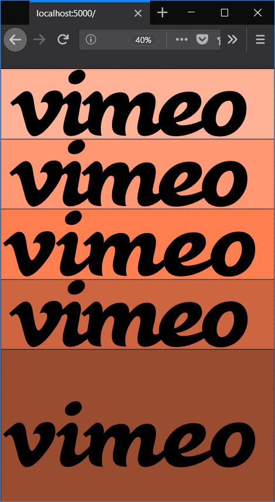

# SVG Shapes vs SVG Text vs Font

On `index.html`, you will find different versions of the Vimeo logo using SVG and simply text. Each version uses either:

* [SVG Shapes](https://developer.mozilla.org/en-US/docs/Web/SVG/Tutorial/Paths)
* [SVG Text](https://developer.mozilla.org/en-US/docs/Web/SVG/Tutorial/Texts)
* [Font](https://developer.mozilla.org/en-US/docs/Web/CSS/font)

They all share the same settings:
```css
 color: black;
 height: 230;
 width: 868;
```

**Can you guess which one is which before looking at the source code?**

Check out answers in the [Documentation]().

.

<p>
    
</p>
